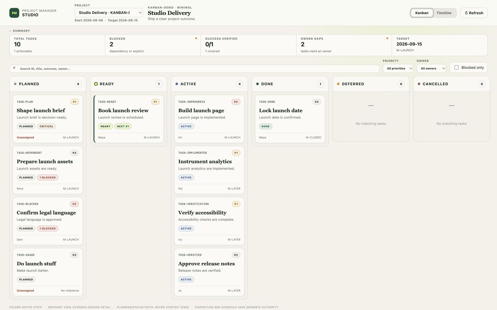
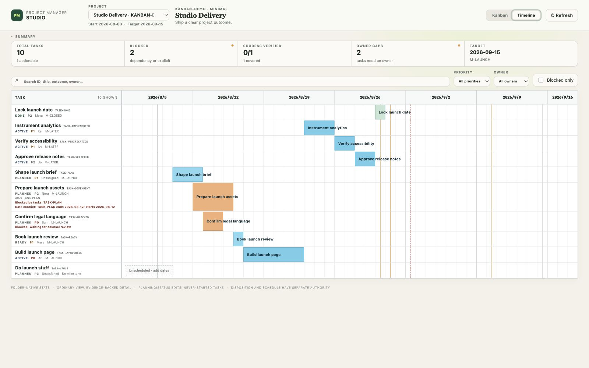

# Project Manager

**An AI project manager you work with through conversation.**

Brief Project Manager as you would a human colleague: explain the outcome, constraints, authority,
and what is changing in the real world. It takes responsibility for the working plan—decomposing the
outcome, coordinating dependencies and owners, maintaining schedules and risks, tracking evidence,
and following changes through.

You set direction and make the business decisions that require your authority. Project Manager
manages the project. You do not have to convert reality into card movements, field edits, statuses,
dependencies, or reports.


> “The vendor API will not be available until September 15. The launch date cannot move. Show me the
> credible options.”

Project Manager traces the affected work, tests the plan against the constraint, updates what the
facts support, and brings back the real tradeoff. One conversation can change tasks, dependencies,
schedules, risks, decisions, evidence, and reporting together.

```text
project reality → reasoning → coordinated change
```

## What you get

- An AI project manager that builds and maintains a verifiable plan tied to your outcome and success
  criteria.
- A current view of progress: what changed, what can move, what is blocked, what threatens the
  outcome, and which decision is needed.
- Connected updates across tasks, dependencies, schedules, risks, and decisions when reality changes.
- Completion backed by evidence, with missing information called out instead of invented.
- Status reports shaped for operators, project managers, executives, or boards without changing the
  underlying facts.
- One coherent project record across people, delegated agents, external executors, and optional
  software workflows such as [RPD](https://github.com/yysun/rpd).

Project truth stays in a durable, versionable Markdown folder and is validated before changes are
saved. Kanban and Timeline visualize that state; they do not become a second source of truth.

## PMI alignment

Project Manager is **PMBOK 7 principles-aligned with documented tailoring**. It is not certified by
PMI, and no tool can be — this describes how the skill is built, not an accreditation.

Tailoring is the load-bearing idea. PMBOK 7 makes tailoring a principle and PMBOK 6 states processes
are selected per project, so leaving out an area is compliant *only when the omission is a recorded
decision*. A project therefore declares each of the ten PMBOK 6 knowledge areas as applied or tailored
out, and tailoring an area out requires a rationale. Reports name a tailored-out area as tailored out
with that rationale — never as zero, absent, or on track.

What that buys you: cost, procurement, or stakeholder management can be genuinely absent from a small
project without the plan looking negligent, while an area you *do* claim to run is enforced. Declaring
an area out while configuring its module is a validation failure, so the declaration cannot become
fiction.

Applied by default: integration (change control, re-verification), scope (success criteria and
traceability), quality (acceptance and evidence), and risk. Available when wanted: assumption log,
issue log, stakeholder register, lessons register, and closure records. Cost, Earned Value, and
critical-path scheduling are not implemented — declare them tailored out, or manage them elsewhere and
say so in the rationale.

## User guides

- [English user guide](skills/project-manager/README.md) — manage through outcomes, events,
  constraints, evidence, and decisions.
- [中文使用指南](skills/project-manager/README-cn.md) — 通过目标、事件、约束、证据和决策管理项目。

## Studio

Kanban shows planned, ready, active, completed, deferred, and cancelled work.



Timeline shows schedules, dependencies, blockers, and date conflicts.



## Install

In your AI agent app, ask:

> Install the `project-manager` skill from `yysun/project-manager`.

## Development

```bash
npm ci
npm test
npm run pm-studio:dev
```

The development server generates a fresh disposable demo project on every start, so you can run it
with no setup. To open a specific project instead:

```bash
npm run pm-studio:dev -- --project /absolute/path/to/project
```

Because a Task Contract binds an absolute project root, a demo is only valid for the checkout that
generated it, so the demo is generated rather than committed. Create a persistent one — useful when
you want Studio edits to survive a restart — with:

```bash
npm run demo
```

That writes `demo/pm-studio-demo/` (gitignored), which you can then pass with
`npm run pm-studio:dev -- --project demo/pm-studio-demo`.

The installable skill is in `skills/project-manager/` and Studio source is in
`src/project-manager-studio/`.

## Technical documentation

- [Skill contract](skills/project-manager/SKILL.md)
- [Project conventions](skills/project-manager/references/conventions.md)
- [Changelog](CHANGELOG.md)
