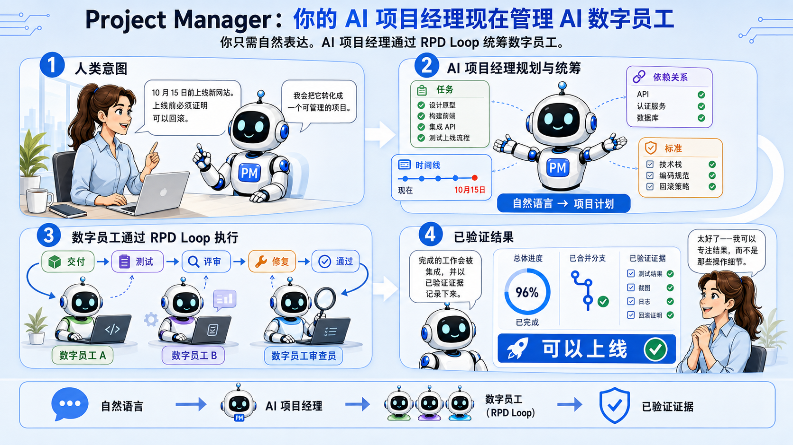

# Project Manager

[English](README.md)

**一名通过对话与你协作的 AI 项目经理。**

像向真人同事交代工作一样向 Project Manager 说明结果、约束、权限，以及现实中正在发生的变化。
它会对工作计划负责：拆解目标、协调依赖与负责人、维护排期与风险、跟踪证据，并持续处理变化带来的影响。

你负责确定方向，并做出需要你授权的业务决策。Project Manager 负责管理项目。你不必把现实情况
转换成卡片移动、字段修改、状态、依赖关系或报告。



> “供应商 API 要到 9 月 15 日才能提供，但上线日期不能变。告诉我有哪些可信的方案。”

Project Manager 会追踪受影响的工作，用新约束检验计划，根据事实更新项目，并给出真正需要权衡的
取舍。一次对话就能同步改变任务、依赖、排期、风险、决策、证据和报告。

```text
项目现实 → 推理 → 协同变更
```

## 你会得到什么

- 一名 AI 项目经理：围绕你的目标和成功标准建立并维护一份可验证的计划。
- 一份当前进展视图：什么发生了变化、什么可以推进、什么被阻塞、什么威胁目标，以及需要做出什么决策。
- 当现实变化时，任务、依赖、排期、风险和决策会同步更新。
- 用证据支撑完成状态；缺失的信息会被明确指出，而不是凭空编造。
- 面向执行人员、项目经理、高管或董事会的状态报告，同时保持底层事实一致。
- 一份连贯的项目记录，覆盖人员、委派的 Agent、外部执行者，以及可选的软件工作流，例如
  [RPD](https://github.com/yysun/rpd)。

项目事实保存在持久、可版本控制的 Markdown 文件夹中，所有变更在保存前都会经过验证。Kanban 和
Timeline 只是这些状态的可视化，不会成为第二个事实来源。

## 与 PMI 的一致性

Project Manager **遵循 PMBOK 7 原则，并对裁剪决策留有记录**。它没有获得 PMI 认证——任何工具
都无法获得此类认证；这里描述的是 Skill 的构建方式，而不是某种资质认可。

裁剪是核心机制。PMBOK 7 将裁剪列为一项原则，PMBOK 6 也明确要求根据项目选择过程，因此只有在
省略某一领域是一项有记录的决策时，这种省略才符合规范。每个项目都必须声明 PMBOK 6 的十大知识
领域是适用还是已裁剪；裁剪掉某个领域时必须说明理由。报告会将其表述为“已裁剪”并附上理由，
绝不会写成零、不存在或进展正常。

这样做的价值在于：小型项目确实可以不采用成本、采购或干系人管理，而不会显得计划有疏漏；但凡
声明要采用的领域，就会受到强制约束。如果将某一领域声明为已裁剪，却又配置了对应模块，验证将
失败，因此裁剪声明无法沦为形式主义。

默认适用的领域包括：整合（变更控制、重新验证）、范围（成功标准与可追溯性）、质量（验收与证据）
以及风险。按需提供：假设日志、问题日志、干系人登记册、经验教训登记册和收尾记录。成本、挣值和
关键路径排期尚未实现——请将它们声明为已裁剪，或者在其他地方管理，并在理由中说明。

## 用户指南

- [English user guide](skills/project-manager/README.md) — 通过结果、事件、约束、证据和决策来管理项目。
- [中文使用指南](skills/project-manager/README.zh-CN.md) — 通过目标、事件、约束、证据和决策管理项目。

## Studio

Kanban 展示已计划、已就绪、进行中、已完成、已推迟和已取消的工作。


Timeline 展示排期、依赖、阻塞和日期冲突。


Studio 会监视所选项目的持久状态，并在 CLI、Agent 或其他编辑器修改项目时自动刷新。如果任务表单或
排期草稿仍处于打开状态，自动刷新会暂停，以免丢弃本地编辑；此时仍可使用 Refresh 按钮手动恢复。

## MCP App

Studio 是一个浏览器窗口。MCP App 将相同的项目事实直接放进对话中，因此你正在讨论的状态会显示在
改变它的那句话旁边。

它提供两种视图。内嵌卡片展示任务数量、被阻塞的工作、已验证的成功标准、负责人缺口和目标日期。
全屏看板展示所有泳道，并可就地展开任务详情。

MCP App **只读**。你仍然通过与 Agent 对话，以及使用 Skill 和 CLI 脚本来修改项目；App 本身从不
写入数据。它以 MCP stdio CLI 的形式运行，读取的正是 Studio 所读取的同一份已验证项目状态。

不支持渲染 MCP App 的宿主仍然可以使用这些工具，只是会收到精简文本摘要，而不是可视化界面。

### 作为 Agent Plugin 安装

仓库根目录是一个自包含的 [Agent Plugins 1.0](https://agent-plugins.org/) 软件包。支持从 GitHub
安装的 Agent Plugins 客户端可以克隆 `yysun/project-manager`，直接加载仓库根目录，无需选择某个
生成的子目录。

```text
project-manager/
├── plugin.json
├── mcp.json
├── skills/project-manager/       # 规范 Skill
├── bin/project-manager-mcp.mjs   # 已打包的 MCP 服务器
└── ui/                           # 自包含的 MCP App 视图
```

`npm run build:plugin` 会就地刷新已提交的 `bin/` 和 `ui/` 运行时产物。源代码、测试和构建工具可以与
可移植组件共存；Agent Plugins 客户端只会发现根目录中固定的清单、`skills/` 和 `mcp.json` 路径。

### 在 Claude Desktop 中安装

Claude Desktop 不读取 Agent Plugins 软件包，因此请将服务器添加到 `claude_desktop_config.json`
（macOS：`~/Library/Application Support/Claude/`）：

```json
{
  "mcpServers": {
    "project-manager": {
      "command": "node",
      "args": ["/absolute/path/to/project-manager/bin/project-manager-mcp.mjs"]
    }
  }
}
```

### 选择项目

默认不配置项目路径。你提供文件夹时，Agent 会将该路径传给 `project status <folder>` 等命令和
MCP App。省略文件夹时，Agent 只会在所选工作区根目录下搜索：找到一个有效项目时自动选择；找到
多个时需要选择；一个都没有时则需要明确提供文件夹。无论启动时是否配置过路径，文件夹都可以使用。

配置是可选的，启用后有两个作用。`--projects-root <folder>`（或
`PROJECT_MANAGER_PROJECTS_ROOT`）允许按 ID 或名称而非路径选择项目，**同时将选择范围限制在该根
目录内**——位于目录之外的项目会被拒绝。`--project <folder>` 用于固定单个项目。两者都不设置时，
服务器启动后不会预先配置任何项目，而是等待调用方指定。

需要注意：未配置项目根目录时，服务器可以读取机器上的任意 Project Manager 项目——这与 CLI
脚本已经赋予 Agent 的访问范围相同。它只读取能够被解析为项目的文件夹，不会读取任意文件。如果
希望限制范围，请设置项目根目录。

## 安装

请选择与你的需求相符的安装方式。

如需完整的 Agent Plugin——包括 Skill、MCP 服务器和 MCP App——请在支持从 GitHub 安装 Agent
Plugin 的客户端中提出：

> 从 GitHub 安装 Project Manager Plugin：`yysun/project-manager`。

如果只需要独立 Skill，请向 Codex 提出：

> 从 GitHub `yysun/project-manager` 安装 Project Manager Skill。

Codex 会检查仓库，并将 `skills/project-manager/` 安装到它的 Skills 目录。此方式不会安装根目录的
`mcp.json`、`bin/` 或 `ui/`，因此 MCP 工具和内嵌 App 不可用。无法自动识别嵌套 Skill 路径的安装器
可能需要明确指定 `skills/project-manager`。

## 开发

```bash
npm ci
npm test
npm run pm-studio:dev
```

开发服务器每次启动都会生成一个全新的临时演示项目，因此无需设置即可运行。如需打开特定项目，请使用：

```bash
npm run pm-studio:dev -- --project /absolute/path/to/project
```

由于 Task Contract 会绑定项目根目录的绝对路径，演示项目只对生成它的检出目录有效，因此它是动态生成
而非提交到仓库的。如需创建一个持久演示项目——例如希望 Studio 中的编辑在重启后仍然保留——请运行：

```bash
npm run demo
```

该命令会写入 `demo/pm-studio-demo/`（已被 git 忽略），随后可通过以下命令将其传给 Studio：

```bash
npm run pm-studio:dev -- --project demo/pm-studio-demo
```

可安装的 Skill 位于 `skills/project-manager/`，Studio 源代码位于 `src/project-manager-studio/`。
MCP 服务器独立放在 `src/mcp-app/`；MCP App 适配器和视图与共享的 Studio 代码一起位于
`src/project-manager-studio/mcp-app/`。可移植清单保留在仓库根目录。

## 技术文档

- [Skill 合约](skills/project-manager/SKILL.md)
- [项目约定](skills/project-manager/references/conventions.md)
- [更新日志](CHANGELOG.md)
