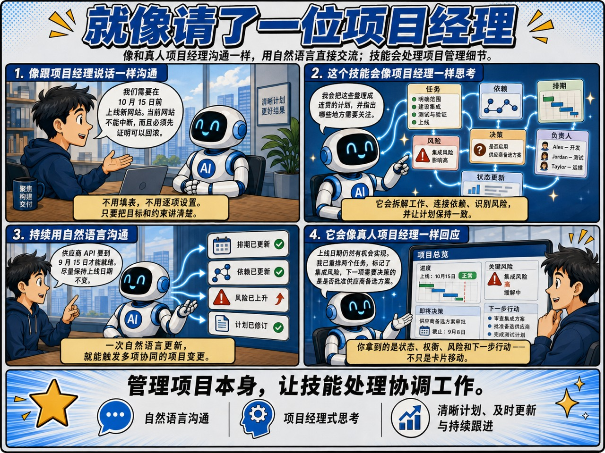

# Project Manager — 中文用户指南

[English guide](README.md)

Project Manager 是一名通过对话与你协作的 AI 项目经理。像与真人同事沟通一样向它交代
项目，并持续告诉它目标、现实变化、风险和必须做出的决策。你主导业务结果，它负责
项目管理机制并让项目始终与现实保持一致。



## 你会得到什么

Project Manager 负责让一份连贯的项目计划始终与现实保持一致。你向它提供项目经理
所需的上下文和方向：

- 什么结果最重要；
- 现实中发生了什么；
- 哪些条件必须继续成立；
- 已经有哪些证据；
- 面临什么决策或取舍。

Project Manager 判断这些信息会如何影响计划，协调连锁变化，并告诉你什么需要关注。一句话
可能同时更新任务、依赖、排期、风险、决策、证据和报告。文件与视图只是实现细节，不是你
必须掌握的语言。

你主导业务结果，并做出需要你授权的决策。Project Manager 负责日常项目管理：规划工作、维护项目
状态、协调依赖、跟踪证据与风险，并把需要决策的问题和取舍带回给你。

## 1. 安装 Skill

在 AI Agent 应用中提出：

> 从 `yysun/project-manager` 安装 `project-manager` Skill。

安装后，直接谈论项目即可。当请求符合用途时，Codex 可以自动选择该 Skill。如果需要明确
选择，请提及 `$project-manager`。

## 2. 向你的 AI 项目经理交代项目

打开要使用的工作区，然后描述目标和重要边界：

> 在这个工作区中，我们需要在 10 月 15 日上线新版网站，同时保证现有网站不中断。上线前
> 必须证明可以回滚。建立这个项目，判断哪些结果必须实现，挑战所有模糊之处，并指出需要我
> 做出的决策。

Project Manager 会建立项目文件夹，定义可衡量的成功标准，并从目标反推包含必要任务和依赖
的可验证计划。它会接管这份工作计划。如果不同理解会显著改变项目，它会把需要你决定的
问题带回来；它不应该要求你设计字段或工作流。

最终得到的是持久项目文件夹和有依据的计划。请检查它是否正确理解目标、约束和取舍，而不是
检查它是否生成了你原本会选择的看板配置。

## 3. 通过持续对话让它管理项目

交代完项目后，在项目变化时继续与 Project Manager 对话。将发生的事件、约束、证据和决策告诉
它。它会判断这些变化对项目的影响，而不是让你把现实翻译成字段、状态或卡片移动。

最常见的对话从周期性的状态与进展管理开始，再进入重新规划和异常处理：

### 你需要一份状态报告

> 给我本周的项目经理更新：发生了什么变化、相对计划的进展、最大风险、下一项重点，以及
> 现在需要做出的决策。

Project Manager 会比较当前事实与计划，解释偏差、成果、问题和下一步。它会针对执行人员、
项目经理、高管或董事会调整重点，但不会改变底层事实。

### 工作取得了进展

> 安全团队已经在 SEC-1842 中批准生产设计，所有上线供应商也已经确认，但监控演练尚未完成。

Project Manager 会记录证据，只推进证据能够支持的工作，并说明新进展解除了哪些阻塞。它会
保留尚未满足的验收条件，不会把一条积极更新变成全面完成。

### 团队需要明确重点

> 本周只有两名开发人员，而且只有 Priya 能批准迁移。优先保护对上线最重要的工作。

Project Manager 会综合就绪状态、依赖、负责人、优先级和成功标准覆盖率进行判断。如果项目
没有足够信息支持可信建议，它会说明缺少什么，而不是编造产能。

### 计划需要调整

> 试点范围现在从五个地区缩减为两个。10 月日期仍然重要，而且不能削减用户引导。给出调整后
> 的计划和后果。

Project Manager 会修改事实支持的工作、依赖和排期，找出可以延期的内容，并检查剩余计划
是否仍能证明预期结果。

### 风险或问题需要处理

> 供应商 API 要到 9 月 15 日才能提供，但 10 月试点仍然需要准备好用户引导。告诉我可信的
> 选择。

Project Manager 会追踪影响，并比较真实选择：调整顺序、范围、人员、临时方案、升级处理或
日期。如果一个结果被拒绝，它会保留已接受的工作、隔离返工，并说明下游影响，而不是盲目
重新打开所有工作。

### 决策或范围发生变化

> 我们选择供应商 B，因为供应商 A 无法满足安全要求。更高成本已经接受。把这个决策贯彻到
> 整个项目，并告诉我它改变了什么。

Project Manager 会记录决策，更新受影响的范围、工作、依赖和风险，并让后续规划与报告保持
一致。

## 提出管理问题

好的问题围绕项目，而不是工具：

- 我们真的能按计划完成吗？这个判断有哪些证据？
- 什么对目标日期威胁最大？
- 如果 API 延迟十天，下游会发生什么？
- 成功标准中有哪些部分尚未被已完成工作覆盖？
- 哪个决策能够解锁最重要的工作？
- 在保留核心结果的前提下可以削减什么？
- 和上周相比发生了什么变化？为什么重要？
- 计划中的哪些部分依赖没有依据的假设？

Project Manager 应该用事实、未知、判断和建议回答，而不是只复述卡片与状态。

## 继续管理已有项目

在 AI Agent 应用中选择已有项目，然后继续描述现实情况：

> 继续管理网站上线项目。安全团队已经在 SEC-1842 中批准生产设计，但监控负责人下周不在。
> 告诉我这会改变什么。

在当前对话中，可以直接说“这个项目”。切换项目或指代不明确时，请选择另一个项目。

## 用一句话执行 RPD 软件工作

对于软件项目，在规划时告诉 Project Manager 将编码任务交给 RPD 执行器，并绑定到对应的 Git
仓库。项目可以开始执行后，直接用中文说出项目名称：

> 执行“网站上线”项目中的所有 RPD 工作。

Project Manager 会先验证项目，只启动依赖已经完成的任务，并把互不依赖的就绪任务按批次并行
执行。每个任务使用独立的子 Agent、Git 分支和 worktree；RPD 负责实现、测试、修正和独立评审。
随后，Project Manager 按依赖顺序集成各分支，测试组合后的结果，并记录能够证明每项验收条件
的证据。

这条命令不表示“同时运行整个待办列表”。非 RPD 任务仍由原执行器负责；被阻塞的执行尝试会被
保留；只有无关且已经就绪的工作会继续。该流程会创建本地提交和集成分支，但不会推送、创建
Pull Request，也不会为了通过而削弱任务要求。最终报告会指出集成分支和保留的协调 worktree，
供你检查。

Project Manager 只会在当前所选工作区 `.projects` 文件夹的已验证项目中解析“网站上线”。精确的
项目 ID 或文件夹名称也可以使用。如果名称不存在或匹配多个项目，它会询问你具体指哪个项目，
而不会猜测或搜索整个文件系统。命令形式 `project execute-rpd <项目名称>` 仍可作为备用方式，
但不是必需的。

## Studio 是可选的可视化界面

对话是主要管理界面。当你想以可视方式检查同一项目，或调整符合条件的规划细节时，可以使用
Project Manager Studio。

> 让我在 Project Manager Studio 中检查这个项目。

如果工作区包含 `.projects/`，也可以要求从其中选择项目。

### 看板

看板把工作概括为 Planned、Ready、Active 和 Done，同时保留 Deferred 与 Cancelled 工作。
用它检查任务结果、验收条件、依赖、阻塞、证据和负责人。它是项目事实的投影，不是需要另行
同步的第二套系统。

### 时间线

时间线显示明确的任务排期、依赖、阻塞和日期冲突。它要求项目同时包含开始日期与目标日期：

```yaml
start_date: "2026-09-01"
target_date: "2026-11-30"
```

排期区块用颜色概括任务状态：

| 颜色 | 任务状态 |
| --- | --- |
| 浅蓝色 | Planned 或 Ready |
| 蓝色 | Active |
| 橙色 | Deferred 或 Cancelled，或者存在阻塞或日期冲突警告 |
| 绿色 | Done |

警告颜色优先于普通生命周期颜色。任务列也会用文字显示状态，因此颜色不是唯一提示。

可以移动或调整符合条件的任务排期，然后保存草稿。冲突会产生警告；Studio 不会自动重排
依赖工作。排期只是计划，不是进度或完成证明。

## 只需了解的几条规则

### 项目事实保存在文件夹中

每个项目最初包含：

- `PROJECT.md`，记录目标和成功标准；
- `TASKS.md`，记录工作、依赖、阻塞和负责人；
- `STATUS.md`，作为生成的摘要。

`PROJECT.md` 和 `TASKS.md` 是权威状态。只有里程碑、风险、决策、来源、追踪关系或报告确实
改善项目时，才会添加可选文件。

### “完成”需要证据

一句肯定说明、一个已关闭工单、一次提交或一个文件本身都不能证明完成。Project Manager 会
记录能够证明验收条件的审批、产物、评审或其他证据。普通人工工作可能只需一条明确审批；
委派执行或严格管控的工作会使用更强的证据记录。

### 阻塞、延期和取消含义不同

- **阻塞**的工作仍然重要，但在障碍解决前无法推进。
- **延期**的工作被主动暂停，之后可以恢复。
- **取消**的工作永久关闭，不会满足依赖，也不能证明成功。

### 未知信息保持未知

Project Manager 不会编造负责人、日期、产能、预测、进度或覆盖率。无法做出可靠判断时，
它会指出缺少什么。

### 说明哪些管理领域适用，以及为什么

Project Manager 通过**有记录的裁剪**（documented tailoring）与 PMI 的 PMBOK 7 原则保持一致。
PMI 并不要求每个项目都执行全部管理领域，而是要求"不做某个领域"是一个决定，而不是疏漏。
Project Manager 正是这样处理的。

你可以直接说明哪些领域适用：

> 这个项目没有预算，工作由现有团队消化，也不涉及采购。其他领域都适用。

它会把 PMI 的十个知识领域逐一记录为"适用"或"经决定不使用"，并附上你给出的理由。
之后报告会写成"成本：未跟踪——无预算，由现有团队消化"，而不是给出一个误导性的零，
也不是悄悄略过。小项目不会因为跳过确实不需要的部分而显得管理不善。

反向约束同样生效：如果你声明某个领域不适用，之后又开始使用它，
Project Manager 会拒绝这种矛盾，而不是让声明变成空话。

随着项目需要，你还可以维护假设日志、问题日志、干系人登记册、经验教训和收尾记录。
它们只在有帮助时出现，都不是必需的。

成本跟踪、挣值管理和关键路径排程并未内置。如果项目需要它们，
请在其他工具中管理并说明，Project Manager 会记录在何处管理，而不会假装拥有这些数据。

## Project Manager 何时会提出异议

提出异议是产品能力的一部分。Project Manager 应该挑战：

- 没有排期依据的目标日期；
- 没有验收证据的完成状态；
- 依赖尚未完成却标记为就绪的工作；
- 没有覆盖成功标准的计划；
- 无法同时满足的范围、产能和日期组合；
- 会改写不可变执行历史的变更。

有用的回应是明确冲突和所需决策，而不是表面成功的更新。

## 常见问题

### Codex 找不到项目

提供包含 `PROJECT.md`、`TASKS.md` 和 `STATUS.md` 的文件夹绝对路径。

### 工作无法推进

询问是什么事实阻碍了进展。原因可能是未完成依赖、明确阻塞、缺少证据、延期处置或已完成
项目的边界限制。

### RPD 执行没有启动任务

符合条件的工作必须处于启用状态、尚未完成、已分配给 `rpd` 执行器、没有阻塞，并且根据项目
依赖规则已经就绪。执行器根目录还必须指向现有 Git 仓库。Project Manager 会报告每个任务被
排除的具体条件，而不是悄悄修改项目。

### Studio 中的任务只读

已有执行历史的工作不能被随意改写。任务对话框会解释准确原因。继续向 Project Manager
描述变化后的现实情况，让它保留历史并选择安全响应。

### 时间线没有有效范围

同时提供项目开始日期和目标日期，然后刷新 Studio。

### Studio 提示项目已经变更

Studio 加载后，另一个进程修改了项目。请刷新，并根据最新事实重新考虑修改，不要覆盖它。

## 进一步了解

- [Skill 运行规则](SKILL.md) — Codex 操作 Project Manager 时遵循的指令。
- [项目状态约定](references/conventions.md) — 精确 schema 与集成契约。
