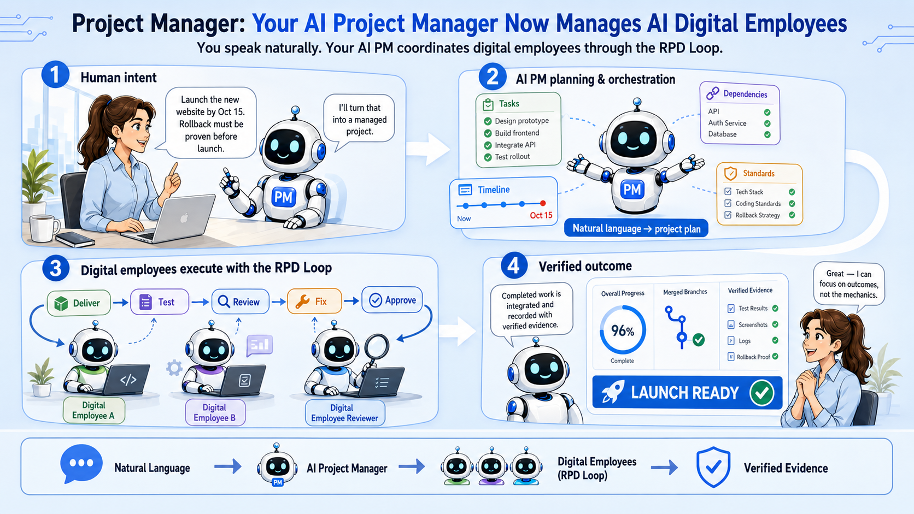

# Project Manager — User Guide

[中文指南](README-cn.md)

Project Manager is an AI project manager you work with through conversation. Brief it and keep it
informed as you would a human colleague: talk about the outcome, what happened, what changed, what is
at risk, and what decision must be made. It handles the project-management mechanics and keeps the
project aligned while you lead the outcome.



## What you get

Project Manager takes responsibility for keeping a coherent project plan aligned with reality. You
give it the context and direction a project manager needs:

- what outcome matters;
- what happened in the real world;
- what must remain true;
- what evidence exists; and
- what decision or tradeoff you face.

Project Manager decides how that meaning affects the plan, coordinates the consequences, and tells
you what needs attention. One statement may update tasks, dependencies, schedules, risks, decisions,
evidence, and reporting together. The files and views are implementation details, not the language
you must speak.

You lead the business outcome and make decisions that require your authority. Project Manager runs
the day-to-day project management: planning the work, maintaining project state, coordinating
dependencies, tracking evidence and risks, and bringing decisions and tradeoffs back to you.

## 1. Install the skill

In your AI agent app, ask:

> Install the `project-manager` skill from `yysun/project-manager`.

Once installed, talk about the project normally. Codex can select the skill when your request matches
its purpose. If you want to select it explicitly, mention `$project-manager`.

## 2. Brief your AI project manager

With the intended workspace open, describe the outcome and important boundaries:

> In this workspace, we need to launch the new website by October 15 without interrupting the current
> site. Rollback must be proven before launch. Establish the project, work out what needs to be true,
> challenge anything vague, and surface the decisions I need to make.

Project Manager establishes the project, defines measurable success, and works backward into a
verifiable plan with the necessary tasks and dependencies. It takes ownership of the working plan.
It may bring you a decision when different interpretations would materially change the project; it
should not ask you to design its fields or workflow.

The result is a durable project folder and a reasoned plan. Review whether it understood the outcome,
constraints, and tradeoffs—not whether it produced the board configuration you would have chosen.

## 3. Let it manage through ongoing conversation

Once briefed, keep talking to Project Manager as the project changes. Give it events, constraints,
evidence, and decisions as they occur. It works out the project consequences instead of making you
translate reality into fields, statuses, or card movements.

The most common conversations start with recurring status and progress work, then move into
replanning and exception handling:

### You need a status report

> Give me the weekly project-manager update: what changed, progress against the plan, the biggest
> risk, the next priority, and the decision needed now.

Project Manager compares current facts with the plan and explains variance, accomplishments, issues,
and next steps. It changes the emphasis for an operator, project manager, executive, or board without
changing the underlying facts.

### Progress was made

> Security approved the production design in SEC-1842, and every launch vendor confirmed. The
> monitoring rehearsal is still incomplete.

Project Manager records the evidence, advances only the work that evidence supports, and shows what
the new progress unblocks. It keeps unfinished acceptance visible instead of turning a positive update
into blanket completion.

### The team needs focus

> We have only two developers this week, and Priya is the only person who can approve the migration.
> Protect the work that matters most to launch.

Project Manager reasons about readiness, dependencies, ownership, priority, and success coverage. If
the project lacks enough information for a credible recommendation, it says what is missing rather
than inventing capacity.

### The plan needs adjustment

> The pilot will now cover two regions instead of five. The October date still matters, and onboarding
> cannot be cut. Work out the revised plan and consequences.

Project Manager revises the supported work, dependencies, and schedule; identifies what can be
deferred; and checks whether the remaining plan still proves the intended outcome.

### A risk or issue needs attention

> The vendor API will not be available until September 15. We still need onboarding ready for the
> October pilot. Show me the credible options.

Project Manager traces the impact and compares the real choices: sequencing, scope, staffing,
workaround, escalation, or date. If an outcome is rejected, it preserves accepted work, isolates the
rework, and reports the downstream impact instead of blindly reopening everything.

### A decision or scope changed

> We chose Vendor B because Vendor A cannot satisfy the security requirement. The higher cost is
> accepted. Carry that decision through the project and tell me what it changes.

Project Manager records the decision, updates affected scope, work, dependencies, and risks, and
keeps future planning and reporting consistent with it.

## Ask management questions

Good questions are about the project, not the tool:

- Are we actually on track, and what evidence supports that judgment?
- What threatens the target date most?
- If the API slips by ten days, what breaks downstream?
- What part of the success criteria is not covered by completed work?
- Which decision would unlock the most important work?
- What could we cut while preserving the core outcome?
- What changed since last week, and why does it matter?
- Where is the plan relying on an unsupported assumption?

Project Manager should answer with facts, unknowns, judgment, and recommendations—not merely recite
cards and statuses.

## Resume an existing project

Select the existing project in your AI agent app, then continue with the real situation:

> Continue managing the website launch. The security team approved the production design in SEC-1842,
> but the monitoring owner is now away next week. Tell me what that changes.

Within the conversation, you can refer to “this project.” Select another project when switching or
when the reference is ambiguous.

## Execute delegated agent work

When project tasks are assigned to the `agent` executor, ask Project Manager to execute the project
normally:

> Execute the ready agent work for this project.

Project Manager stays in the coordinator role. It validates the project, starts one bounded subagent
for each dependency-ready task, and gives that worker only its immutable Task Contract and task-local
context. Independent tasks can run together when capacity exists and their executor roots and write
targets are proven separate. Shared roots, overlapping targets, uncertain writes, and dependency-linked
tasks run serially. A task with no executor root is limited to filesystem-read-only work or one explicit
non-filesystem target; local or uncertain mutation needs a safe declared root first.

Each worker returns one compact terminal Evidence Manifest JSON object, not a transcript. Project
Manager validates and ingests that payload before it treats the work as progress or unlocks the next
dependency wave. It keeps the main coordinator's capacity slot and project context separate from worker
context. A worker never edits the project's `PROJECT.md`, `TASKS.md`, `STATUS.md`, `CHANGES.md`, or
`handoffs/` state.

Human work stays human-owned. If a human task explicitly represents an approval, it is a real
dependency gate: downstream agent and [RPD](https://github.com/yysun/rpd) work stays planned until specific approval evidence is
recorded. Project Manager then revalidates those dependents and moves eligible work to ready before
starting its execution route. Other human tasks may require authored work or custom evidence and are
not reduced to approval-only steps. [RPD](https://github.com/yysun/rpd) tasks continue through the dedicated [RPD](https://github.com/yysun/rpd) execution route below.

Under the hood, Project Manager uses the installed commands rather than generating `.pm-agent-exec.js`
or another helper inside your project or executor folder:

```bash
node <skill-dir>/scripts/project-start-agent.js <project-folder> <task-id> --json
node <skill-dir>/scripts/project-ingest-agent-manifest.js <project-folder> <task-id> --json
```

The first command returns the immutable contract path. The second reads exactly one Evidence Manifest
payload object from standard input and applies only validated lifecycle progress. Blocked attempts remain
visible and immutable; an explicit retry gets a new contract after its exact blocker is cleared.

## Execute [RPD](https://github.com/yysun/rpd) software work with one line

For a software project, ask Project Manager to assign its coding tasks to the [RPD](https://github.com/yysun/rpd) executor and bind
them to the relevant Git repository during planning. When the project is ready, use ordinary English
and give its project name:

> Execute all [RPD](https://github.com/yysun/rpd) work for the Website Launch project.

Project Manager validates the project, starts only tasks whose dependencies are complete, and runs
independent ready tasks in parallel waves. Each task gets its own subagent, Git branch, and worktree;
[RPD](https://github.com/yysun/rpd) handles implementation, testing, correction, and independent review. Project Manager then
integrates the branches in dependency order, tests the combined result, and records the evidence that
supports each task's acceptance criteria.

This command does not mean “run the entire backlog at once.” It leaves non-[RPD](https://github.com/yysun/rpd) tasks with their
assigned executors, preserves blocked attempts, and continues only with unrelated ready work. It
creates local commits and an integration branch, but does not push, open a pull request, or weaken a
task to make it pass. The final report identifies the integration branch and retained coordinator
worktree for inspection.

Project Manager resolves `Website Launch` only among validated projects directly inside the selected
workspace's `.projects` folder. An exact project ID or folder name also works. If the name is missing
or matches more than one project, it asks which project you mean instead of guessing or searching the
filesystem. The command-style `project execute-rpd <project-name>` remains available as an escape
hatch, but it is not required.

## Studio is an optional visual surface

Conversation is the primary management interface. Project Manager Studio is useful when you want to
inspect the same project visually or adjust eligible planning details.

Studio watches the selected project's durable state and refreshes automatically after changes made by
the CLI, an agent, or another editor. It defers that refresh while a task dialog or Timeline schedule
draft is open, then reconciles once editing is safe. Manual Refresh remains available for recovery.

> Let me inspect this project in Project Manager Studio.

From a workspace containing `.projects/`, you can also ask to choose among its projects.

Initializing a project from a selected workspace root also creates `studio.sh` and `studio.cmd` in that
workspace. Run `./studio.sh` on POSIX or `studio.cmd` on Windows. Both launchers read the active skill
installation from `.projects/.env.local`, which `.projects/.gitignore` keeps local, then open the
workspace's `.projects` catalog. They preserve Studio arguments, so `./studio.sh --no-open --port 43123`
works as expected. If either launcher name already contains unrelated content, or the local skill path
is missing or invalid, initialization or launch fails clearly instead of overwriting the file or
guessing another installation. Explicit standalone project-folder initialization does not add these
workspace files.

### Kanban

Kanban summarizes work as Planned, Ready, Active, and Done, with Deferred and Cancelled work kept
visible. Use it to inspect outcomes, acceptance criteria, dependencies, blockers, evidence, and
ownership. It is a projection of project truth, not a second system to keep synchronized.

### Timeline

Timeline shows explicit task schedules, dependencies, blockers, and date conflicts. It needs both a
project start date and target date:

```yaml
start_date: "2026-09-01"
target_date: "2026-11-30"
```

Schedule bars use color to summarize task state:

| Color | Task state |
| --- | --- |
| Light blue | Planned or Ready |
| Blue | Active |
| Orange | Deferred, or a warning caused by a blocker or date conflict |
| Grey | Cancelled |
| Green | Done |

A warning overrides the normal active lifecycle color; cancelled work remains grey. The task column
also shows the status in text, so color is never the only indicator.

You can move or resize eligible task schedules and save the draft. Conflicts produce warnings;
Studio does not silently replan dependent work. Schedules are plans, not proof of progress or
completion.

## The few rules worth knowing

### Project truth lives in the folder

Every project begins with:

- `PROJECT.md` for the objective and success criteria;
- `TASKS.md` for work, dependencies, blockers, and ownership; and
- `STATUS.md` as a generated summary.

`PROJECT.md` and `TASKS.md` are authoritative. Optional files appear only when milestones, risks,
decisions, sources, traceability, or reports improve the project.

### “Done” requires evidence

A confident message, closed ticket, commit, or file is not proof by itself. Project Manager records
the approval, artifact, review, or other evidence that demonstrates the acceptance criteria. Ordinary
human work may need only one specific approval; delegated or controlled work uses a stronger trail.

### Blocked, deferred, and cancelled are different

- **Blocked** work still matters but cannot advance until its obstacle is resolved.
- **Deferred** work is intentionally paused and may be reactivated.
- **Cancelled** work is permanently closed. It does not satisfy dependencies or prove success.

### Unknown stays unknown

Project Manager does not invent owners, dates, capacity, forecasts, progress, or coverage. It names
missing information when a sound judgment cannot be made.

### Say which disciplines apply, and why

Project Manager is aligned with PMI's PMBOK 7 principles through *documented tailoring*. PMI does not
require every project to run every discipline — it requires that leaving one out be a decision rather
than an oversight. That is exactly how Project Manager treats it.

You can tell it which areas apply:

> We have no budget for this — the work is absorbed by the standing team. There is no procurement
> either. Everything else applies.

It records each of the ten PMI knowledge areas as applied or deliberately not used, with your reason.
Reports then say “Cost: not tracked — no budget; absorbed by the standing team” instead of showing a
misleading zero or quietly omitting it. A small project stops looking negligent for skipping what it
genuinely does not need.

The reverse is enforced too: if you say an area does not apply and then start using it, Project
Manager refuses the contradiction rather than letting the declaration become fiction.

As a project needs them, you can also keep an assumption log, an issue log, a stakeholder register,
lessons learned, and closure records. They appear only when they help; none of them are required.

Cost tracking, earned value, and critical-path scheduling are not built in. If your project needs
them, manage them elsewhere and say so — Project Manager will record where, rather than pretend.

## When Project Manager pushes back

Pushback is part of the product. Project Manager should challenge:

- a target date with no schedule evidence;
- completion with no acceptance evidence;
- work marked ready while a dependency is unfinished;
- a plan that does not cover the success criteria;
- a requested combination of scope, capacity, and date that cannot all hold; and
- a change that would rewrite immutable execution history.

The useful response is the conflict and the decision needed—not a superficially successful update.

## Common problems

### Codex cannot find the project

Give it the absolute path to the folder containing `PROJECT.md`, `TASKS.md`, and `STATUS.md`.

### Work cannot advance

Ask what fact prevents progress. The cause may be an unfinished dependency, explicit blocker, missing
evidence, deferred disposition, or completed project boundary.

### [RPD](https://github.com/yysun/rpd) execution starts no tasks

Eligible work must be active, unfinished, assigned to the `rpd` executor, free of blockers, and ready
under the project's dependency rules. Its executor root must also resolve to an existing Git
repository. Project Manager reports which condition excluded each task instead of silently changing
the project.

### A task is read-only in Studio

Work with execution history cannot be casually rewritten. The task dialog explains the exact reason.
Continue by describing the changed reality to Project Manager so it can preserve history and choose a
safe response.

### Timeline has no useful range

Provide both the project start date and target date, then refresh Studio.

### Studio says the project changed

Another process changed the project after Studio loaded an edit form. Studio will normally refresh
automatically once the form or schedule draft closes. If a save reports a revision conflict, close or
cancel the stale draft, use Refresh if needed, and reconsider the edit against the latest facts instead
of overwriting them.

## Learn more

- [Skill contract](SKILL.md) — instructions governing how Codex operates Project Manager.
- [Project-state conventions](references/conventions.md) — exact schemas and integration contracts.
